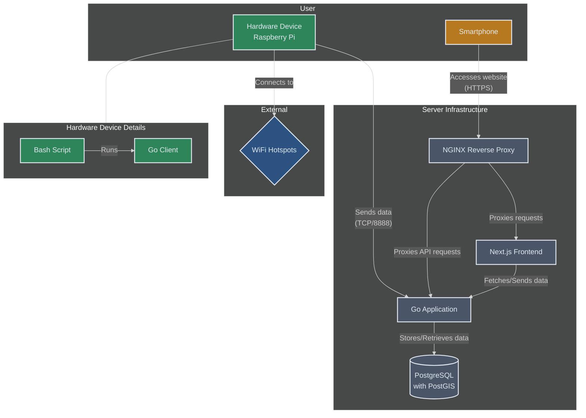
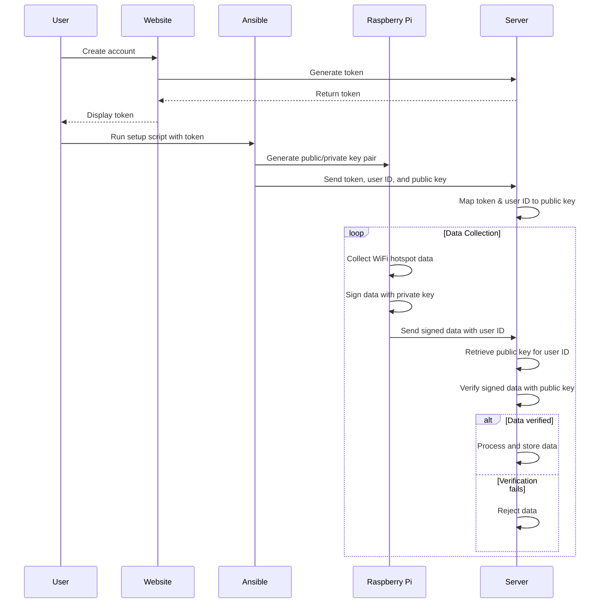

Visit my site here: [https://touchgrass.au](https://touchgrass.au) to find out more.

Touch grass is a common slang term referring to people that are chronically online, sometimes you just need to go outside and touch some grass and be in the real world. That's what this is, a way to go outside and explore Australia.

# Introduction

Sprawled across Australia is a vast infrastructure that is completely untapped by the public, these landmarks fill big cities and small towns alike with its iconic presence.

What I am referring to is the "Telstra Free Wi-Fi" hotspots that are all around Australia.


I thought it would be fun to do something with these, there are thousands all around the country and no one really uses them. I made a game for myself and decided to travel around Australia using the hotspots as an excuse to explore the country. I did a little roadtrip for a month and went from Sydney to Melbourne to Adelaide to Uluru and then back to Sydney. Within this trip I found hundreds of hotspots in small towns and big cities, I even found one in the middle of the outback, near Uluru. I ended up having a super cool adventure and I thought it would be a great idea to make a sort of adventure game out of it (the photos I took from the trip are on the website). So I present you [Touch grass](https://touchgrass.au)


To play the game, you have to buy a physical device, the device will then wait until you are at a Telstra Wi-Fi hotspot and ping my server to know that you have reached one. You will receive a notification from the web app on your phone which will then allow you to confirm that you are actually there, gaining you points.

This post will be a deep dive in the technical engineering effort of making this project, including the fine grained details of the wifi handshake as well as how I implemented the technology stack.

# Working with Wi-Fi

The initial investigation began by understanding the mechanism of how you connect to the hotspot. I have one near where I live so I was able to do some field testing. The Telstra Wi-Fi hotspot has a captive portal that initially opens up when connecting to the access point, on the captive portal you must agree to the terms and conditions and then you have Wi-Fi. To understand how I could connect using my Raspberry Pi to the Wi-Fi I needed to understand how this captive portal works. Using tools like Burp Suite and the web developer tools on the browser allowed me to understand a bit better what was going on under the hood.

What happens when you don't agree to the terms and conditions? [Captive portals](https://en.wikipedia.org/wiki/Captive_portal) work by redirecting all traffic from the access point if they see that the client is not authenticated, the main way they do this is through the MAC address. If the client is not authenticated, they either intercept web traffic and return a 302 redirect or they use a DNS server to route all unautheticated requests to their captive portal[^1]. In this case, I believe it uses a 302 redirect because when I curl any site (without going through portal) I get a 302

[^1]: https://www.chromium.org/chromium-os/chromiumos-design-docs/network-portal-detection/

```
$ curl http://example.com
<html><body>You are being <a href='https://apac.network-auth.com/splash/NAxIVbNc.5.167/?mac=0C%3A8D%3ADB%3A5E%3A31%3ACC&real_ip=10.174.39.37&client_ip=10.123.81.209&client_mac=00:C0:CA:B4:8C:56&vap=5&a=632667547e7cd3e0466547863e1207a8c0c0c549&b=11747327&auth_version=5&key=d7f118effbe89d7e0767520cb8e65b5c1f8ea9cb&acl_ver=P8136049V2&continue_url=http%3A%2F%2Fexample.com%2F'>redirected</a>.</body></html>
```

The domain network-auth.com is associated with [Cisco Meraki](https://documentation.meraki.com/General_Administration/Cross-Platform_Content/Splash_Page) an enterprise cloud controlled Wi-Fi routing system.

Deciphering the variables:

- mac: the access point's mac address
- real_ip: the IP address of the hotspot
- client_ip: the IP the DHCP server will give the client
- client_mac: the client's mac address
- vap: virtual access point (vap) allows owners to have more fine grain control over AP
- acl_ver: refers to the access control list which defines the rules of the AP
- continue_url: once authenticated where it should redirect to
- key: some key used for authentication, changes after every attempted authentication
- a: after doing some field testing, I found out 'a' refers to the physical payphone, each payphone will have a different 'a'
- b: after doing some field testing, I found out 'b' is a time count in seconds since X

Looking through the captive portal's code. Pressing the agree button does this

```js
onclick=
function() {
    var _request = new XMLHttpRequest();
    var url = 'https://apac.network-auth.com/splash/NAxIVbNc.5.167/grant?continue_url=CONTINUE_URL_PLACEHOLDER';
    _request.open('HEAD', window.location, true);
    _request.setRequestHeader('X-Requested-With', 'XMLHttpRequest');
    _request.onreadystatechange = function() {
    if (_request.readyState === 4) {
        var continue_url = _request.getResponseHeader('Continue-Url');
        window.location.href = url.replace('CONTINUE_URL_PLACEHOLDER', continue_url);
    };
    };
    _request.send(null);
})(); return false;
```

As we can see, hitting the endpoint `https://apac.network-auth.com/splash/NAxIVbNc.5.167/grant` will authorise a client. Manually trying to go this endpoint unfortunately didn't work. I figured out that the endpoint actually does the authentication from cookies that are generated when initially going to the captive portal. Once you use the cookies that you get from visiting the initial redirect, you use these cookies to authenticate yourself and then you have internet access.

Playing around with the paramters in the initial redirect (mac, real_ip, client_ip etc) didn't work very well so it seems they all need to be correct for the correct cookies to be generated. Now that I know the authentication method, I can easily recreate this with a few commands.

1. Connect to the Access Point, the AP doesn't have security so anyone can connect
   `sudo nmcli dev wifi connect 'Free Telstra Wi-Fi'`
2. Use -L to follow redirect and store the cookies
   `curl -c /tmp/cookies.txt -L http://google.com`
3. Use cookies to authenticate to endpoint /grant (-b pass data into cookie header)
   `curl -b /tmp/cookies.txt https://apac.network-auth.com/splash/NAxIVbNc.5.167/grant?continue_url=`
4. Congratulations you are now authenticated

# Creating a Client + Server

My Raspberry Pi can successfully connect to the hotspot. Now what?

I will use use the information I have collected about the handshake to connect with the hotspot (mac, real_ip etc) and send this to my server, this allows a way for me to know if you have connected to a hotspot and then give you points.

I used Golang as my prefered choice for client-server communications because it is fast, lightweight and built in networking capabilities. A simple Go server and client were setup to take in some data from the handshake, encrypt in and then send it over the internet to my server.

It was a bit of overkill and completely unneccessary but I also created a simple custom protocol for how the data was sent, this was done as a fun exercise and I realise that it is not the best maintenance, upgradability and scalability but it was fun.

The protcol sits on top of TCP and below TLS. Its a pretty basic way that allowed me to pack the data and send it as a chunk to the server. For extra extra redundancy, not only is the data encrypted using TLS but I encrypt the data before it is sent using AES-GCM for extra security. This means that you can't see the payload on device without the key (or reverse engineering).

The server checks the payload that comes in and does some checking through the header of the payload to ensure it is valid. It then decrypts the data and stores it in a PostgresDB.

# Designing the user experience

The frontend framework is pretty standard. I'm using Nextjs with NextUI and tailwind components for design. I incorporated features like a visual map to see which hotspots you have visited, data about how many hotspots you've found and other useful statistics and I created a smooth mobile friendly user experience as it would primarily be used on a phone. Here are some screenshots of the app

{:style="width: 100%; display:block; margin-left:auto; margin-right:auto "}\\
{:style="width: 100%; display:block; margin-left:auto; margin-right:auto "}

# Real time notifications

One thing I really wanted to get right was the notifications. I wanted a seamless and delay-free experience from when the Raspberry Pi connects to the hotspot. To do this I would need to integrate a notification system between the three parts of my app. The database, the backend and the frontend.

**Backend <-> Frontend** \\
A few options are possible when streaming data between the frontend and the backend, the main two are polling and websockets. Polling involves sending a request to the server every X seconds asking if it has received new information. This consumes a lot of bandwidth and the tradeoff is either constantly checking the backend (which is a lot of wasted bandwidth) and delays in receiving information (if you poll quite infrequently). A much better option is using a websocket which creates a two way connection between the client and the server. By using websockets we can instantly update the frontend with the new information once the backend has received it. This reduces bandwidth as messages are only sent when they have to, also this means there is no delay from when the backend gets it to when the frontend receives it.

```js
// create websocket
const socket = new WebSocket(`wss://${apiUrl}/ws?jwt=${token}`);

// when a message is received, update the UI
socket.onmessage = (event) => {
  handleRecentEntry();
};
```

**DB <-> Server** \\
This was actually a bit trickier. To implement a real time update and trigger, I had to completely switch databases. I was initially using MySQL but since they were lacking real-time functionality, I opted for Postgres instead which had pg_notify() a handy feature that allows you to trigger a notificaiton if a certain query passes.

```sql

CREATE FUNCTION notify_insert()
RETURNS TRIGGER AS $$
BEGIN
PERFORM pg_notify('new_entry', NEW.deviceuuid);
RETURN NEW;
END;

$$
LANGUAGE plpgsql;

CREATE TRIGGER trigger_notify_insert
AFTER INSERT ON entries
FOR EACH ROW EXECUTE FUNCTION notify_insert();
```

This code listens for any INSERTs into the DB and triggers my go server which then sends the data to the client through the websocket.

# Infrastructure

To build out the infrastructure I wanted to have a modular approach, something that was scalable in the case that millions of people are using the app, I also wanted it to be easy to deploy, upgrade, test etc. For this, I used Dockerfiles and docker-compose for an easy way to build up the infrastructure in one click. The services that are running on the docker compose include the frontend server which uses Nextjs, the backend server that is run using Golang, this server interacts with both the frontend but also processes the data from the device which is sent once the device connects to a hotspot. I have a Postgres backend which has some runscripts for setup and to configure notifications and I also have an NGINX reverse proxy that redirects traffic and faces the internet.

Below is a diagram that pretty accurately shows how these components interact with each other and the flow of data through the system



Designing and configuring the hardware device that will connect to the hotspot also involved some engineering work. Before I began, I considered creating an ios or android app instead. Problems arose when I realised there were many restrictions in regards to how much you can control the network and wifi data on phone apps. Also I thought it would be a lot cooler building a physical thing rather than just some lame app.

In order to productionise and automate the setup of the raspberry pi, I created an ansible playbook that gets a freshly imaged RPi with Raspberry Pi OS Lite and fully configures the setup, this setup includes downloading the appropriate packages, cloning the github, generates some Public/Private keys (explained below), sets up the nmconnection (network manager connection) file, the bash script, the systemd service and the golang binary that runs on device.

# Security is important!

Security is important and I wanted to harden the system from tampering and bypassing.

The first line of defence is outside threats. All data that is sent from the device to the server is sent using TLS and also encrpyted on device before it is sent out.

It is also hard to spoof the data to the server because a unique string is sent which is taken from the handshake with the hotspot, this is like a proof of contact, only if you have the string can you prove that you have been there.

I created an authentication system to ensure only people with the Pi can send data to my server. I did this by first generating a token once the user creates an account on my website. Once the user gets this token, I can setup their RPi by passing the token into the ansible setup script. The script generates a public private key pair and maps the token with the user id to the public key. When the device sends data back to the server, it signs the data with the private key and sends the user id with it. The server will only accept the data if the data that is sent can be validated with the user id's matching public key. This eliminates the risk of others forging payloads.



# Conclusion

This is very much a work in progress, I just wanted something written down about some of the things that I have been working on recently. The application is pretty much ready to be played, I'll soon have a spot where you can purchase a device so you can play the game. There's still a lot of cool features that I'm excited to add in the near future, I want this to be a fun way to get outside and go on an adventure, to see Australia including visiting small towns and places you would never normally visit.
